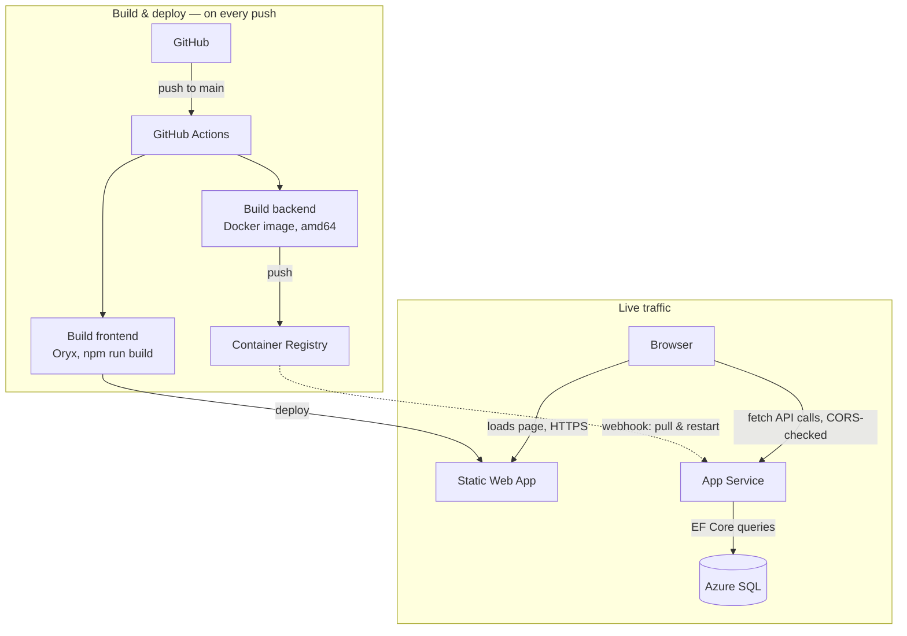

# WetSeason

WetSeason is a Northern Territory wet-season incident coordination app. Communities report
incidents — flooding, cyclone damage, road closures, power outages — and coordinators triage,
track, and resolve them, assigning field resources (crews, vehicles, generators) along the way.

It's a portfolio project built to demonstrate a full .NET / EF Core / React skills matrix: a
React + Vite frontend, an ASP.NET Core Web API backend, EF Core migrations against SQL Server,
JWT-based authentication with role-based access (public user, field officer, coordinator, admin),
and — as of this write-up — a full production deployment on Microsoft Azure.

## Tech stack

| Layer | Technology |
|---|---|
| Frontend | React 19, Vite, Tailwind CSS v4, React Router |
| Backend | ASP.NET Core (.NET 10), Entity Framework Core, FluentValidation |
| Database | SQL Server (Azure SQL in production) |
| Auth | JWT bearer tokens, ASP.NET Identity password hashing |
| Local dev | Docker Compose (all three services) |
| Cloud | Azure Static Web Apps, Azure App Service (containers), Azure SQL Database |
| CI/CD | GitHub Actions |

## Running it locally

```bash
docker compose up -d --build
```

This starts SQL Server, the backend (with hot reload via `dotnet watch`), and the frontend
(built and served through nginx) as three containers on one Docker network. The backend applies
any pending EF Core migrations automatically on startup — no manual `dotnet ef database update`
step needed, locally or in the cloud.

---

## Moving it to the cloud

The rest of this document is a record of migrating WetSeason from "runs on one laptop via Docker
Compose" to "runs on Azure, reachable from any browser on a real domain" — what we picked, why,
and the real problems hit along the way.

### Why these services, and not a VM

The simplest option would have been renting a single Azure VM and running the exact same Docker
Compose setup already working locally — almost no code changes needed. We chose to split the app
across three purpose-built Azure services instead, for one specific reason: the goal wasn't just
to get WetSeason online, it was to actually learn Azure.

Running Docker Compose on an Azure VM is barely different from running it on a laptop — same
containers, same commands, just a different landlord. It also hands you jobs Azure normally does
for free: patching the OS, issuing an HTTPS certificate, taking database backups. None of that is
Azure-specific knowledge.

| Layer | Service | Why |
|---|---|---|
| Frontend | **Azure Static Web Apps** | Purpose-built for a React app that compiles to static files. Free tier, automatic HTTPS on a custom domain, builds straight from a GitHub push — no Docker image to manage. |
| Backend | **App Service for Containers** | Runs the existing backend Docker image as-is. Chosen over Container Apps for simplicity — one container, no need for the scaling/revision features Container Apps adds. |
| Database | **Azure SQL Database** | Replaces the containerized SQL Server. Microsoft handles backups and patching; a serverless tier scales down to near-zero cost when idle. |

### Architecture

The frontend and backend deploy in different ways, which matters a lot in the incident log below —
the frontend builds and deploys in one hop, the backend takes an extra hop through a container
registry and a webhook.



### What went wrong

Ten separate issues, in the order they were hit. Each one blocked progress until it was found —
and in every case, the fix came from checking real evidence (a log line, a certificate, a DNS
record) rather than guessing.

#### Getting the backend to even start

**1. The backend built fine, but Azure said the image didn't exist — `Critical`**
- **What happened:** the Docker image built and pushed without any errors. Azure still refused to
  run it, reporting the image "was not found."
- **Root cause:** the image was built on a Mac with Apple's own chip, producing an `arm64` image
  by default. Azure's servers run on `amd64`. `docker manifest inspect` on the pushed image proved
  it — only an `arm64` variant existed.
- **Fix:** rebuild with `docker build --platform linux/amd64`, then push again.

**2. Azure wasn't allowed to pull its own image — `Major`**
- **What happened:** the very first start attempt failed with a vague "unexpected exception"
  while pulling the image.
- **Root cause:** by default, Azure authenticates to the container registry using an automatic
  identity rather than a username/password. That identity had never been granted permission to
  pull images.
- **Fix:** switch the App Service's registry authentication to the registry's own admin
  username/password.

**3. The backend started, then immediately crashed trying to reach the database — `Major`**
- **What happened:** once the image ran, it crashed seconds later with a database connection
  error.
- **Root cause:** the configured database address was `sqlserver` — the private hostname the
  local Docker setup uses for its own database container. Meaningless outside a laptop; it had
  been copied across by mistake, and the password field was left blank too.
- **Fix:** replace it with the real Azure SQL server address and password from the database's own
  overview page.

**4. The app was running and healthy — and completely unreachable — `Critical`**
- **What happened:** the backend's own logs said "Application started." Visiting the site hung
  forever with no response.
- **Root cause:** testing directly with `curl` showed the HTTPS handshake worked fine, but no
  reply ever came back. Azure's own log eventually named it: traffic was being forwarded to port
  80, while the app only listened on 8080. The `WEBSITES_PORT` setting was correctly `8080` — but
  a second, separate "Port" field elsewhere in the same Container settings screen was still `80`
  and silently overruled it.
- **Fix:** update that second Port field to `8080` to match.

#### Getting the frontend to actually display

**5. The homepage was blank — `Minor`**
- **What happened:** opening the site's plain root URL showed nothing — no error, no login form.
- **Root cause:** the app never had a route defined for `/` at all, only `/login`, `/register`,
  and `/incidents`. Locally, nobody had ever typed the bare address into a browser.
- **Fix:** add a route redirecting `/` (and any unmatched path) to `/login`.

**6. Refreshing any page but the homepage gave a real 404 — `Minor`**
- **What happened:** clicking around the app worked fine; refreshing on, say, `/incidents` gave a
  genuine "not found" from Azure.
- **Root cause:** React Router handles navigation entirely client-side — there's no real file at
  `/incidents` on the server. A refresh asks the server directly for that path.
- **Fix:** add a `staticwebapp.config.json` with a `navigationFallback` rule serving `index.html`
  for any unrecognised path, letting React Router take over.

#### Connecting the two halves for real

**7. The new database was empty — `Minor`**
- **What happened:** the app worked but showed nothing — no communities, no incidents.
- **Root cause:** setting up a database only builds its empty schema, not the data sitting in the
  old one — two entirely separate steps.
- **Fix:** read every row out of the local database, script it as `INSERT` statements (respecting
  foreign key order — communities before the incidents referencing them), and run that script
  against Azure SQL.

**8. The browser refused to talk to the backend, even after fixing the setting three times — `Critical`**
- **What happened:** logging in from a real custom domain failed with a CORS error, and kept
  failing after correcting the allowed-origins setting and restarting — twice.
- **Root cause:** the allow-list was hardcoded into the backend's compiled code, so changing an
  Azure setting alone did nothing — the backend **image itself** needed rebuilding and pushing
  with the new list baked in, and that rebuild had simply been missed.
- **Fix:** move the allow-list out of code and into configuration (`Cors:AllowedOrigins`, read at
  startup) so future domains are just a setting change — then do the one rebuild still owed.

#### Making the whole thing repeatable

**9. Every commit rebuilt everything, including other people's projects — `Minor`**
- **What happened:** this repo is shared with classmates' unrelated projects. Any push triggered
  every automated build in the whole repository.
- **Root cause:** Azure's auto-generated build workflow had no path filter, so it watched the
  entire repo by default.
- **Fix:** add a `paths:` filter so each workflow only triggers for its own folder.

**10. Every backend change meant three manual steps, forever — `Major`**
- **What happened:** unlike the frontend, the backend had zero automation. Every change — ten
  times over across this migration — needed the same manual cycle: rebuild, push, restart.
- **Root cause:** Static Web Apps builds itself straight from GitHub; App Service only runs
  whatever image it's handed, and nothing had been set up to hand it a fresh one automatically.
- **Fix:** see below.

### Automating the backend

| Step | What it does | Why it matters |
|---|---|---|
| Build & push | A GitHub Actions workflow builds the Docker image and pushes it to the registry on every backend push. | Runs on GitHub's own `amd64` runners — permanently fixing issue #1 as a side effect. |
| Notice & restart | A "Continuous Deployment" toggle on the App Service watches the registry and restarts automatically on a new image. | No manual restart step left — pushing code is the entire deployment. |

Deliberately **not** automated: applying database schema changes through the pipeline. The
backend instead checks for and applies pending EF Core migrations itself on every startup — a
few lines of code rather than a pipeline stage, which is the right tradeoff for an app this size
with one running instance. Routing the pipeline through the database's firewall to run migrations
from GitHub's servers would be the more "correct" pattern for a larger team, but it's real added
complexity this project doesn't need.

### Lessons learned

- **A working local setup is not a deployment plan.** Every one of the first four issues was
  something that simply couldn't exist on a laptop — a chip mismatch, a registry permission, an
  internal-only address, a hidden port field.
- **Evidence beats guessing, every time.** The slowest parts of this migration were moments spent
  guessing at a cause instead of pulling the actual log, running `curl` directly, or checking a
  certificate.
- **"It's set correctly" and "it's running" are different questions.** The CORS incident cost the
  most time because a setting was fixed three times while the code reading it was never actually
  redeployed.
- **Cheap infrastructure choices get expensive later.** Hardcoding one origin into CORS worked
  fine — until a second one (a custom domain) needed adding, and adding it meant a full rebuild.
  Reading it from config instead cost five extra lines and removed the problem permanently.
